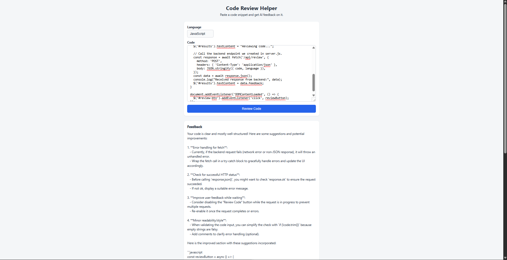

# CodeReviewHelper
AI-powered tool that reviews code snippets and suggests improvements.

# Why I built this
I built this as a side project while in my second year of studying software design.
I went with this project as I'm looking to integrate AI into my projects more, I also wanted to learn more about what good code review looks for and how I can use this project to upgrade and enhance my own code.

# Features
- Paste in a code snippet and get instant feedback
- Highlights potential bugs or bad practices
- Suggests readability/style improvements
- AI-powered tool

# Tech stack
- HTML/CSS/JavaScript (frontend)
- Node.js + Express (backend server)
- Azure OpenAI (via Azure AI Foundry) for AI code review

# How to run it locally
1. Clone this repo
2. Get personal API key and endpoint from Azure OpenAI via Azure AI Foundry
3. remove .example from .env.example
4. Replace AZURE_OPENAI_API_KEY and AZURE_OPENAI_ENDPOINT in .env with your own personal API key and endpoint
5. Open terminal and go to server file ('cd server')
6. run npm install in the terminal while in server file
7. Run server using 'npm start' in the terminal while in server file 

# What I learned
- How to send requests to AI in the backend, receiving answers and displaying the answers on the frontend 

- How to set up cloud infrastructure 

- Learned more about debugging AI such as wrong endpoints, deployment mismatches and model deprecation 

- learned more about validation and dealing with errors and bugs 

# What's next
- Loading states - e.g full loading indicator while waiting for feedback 

- Error handling

# Screenshot
